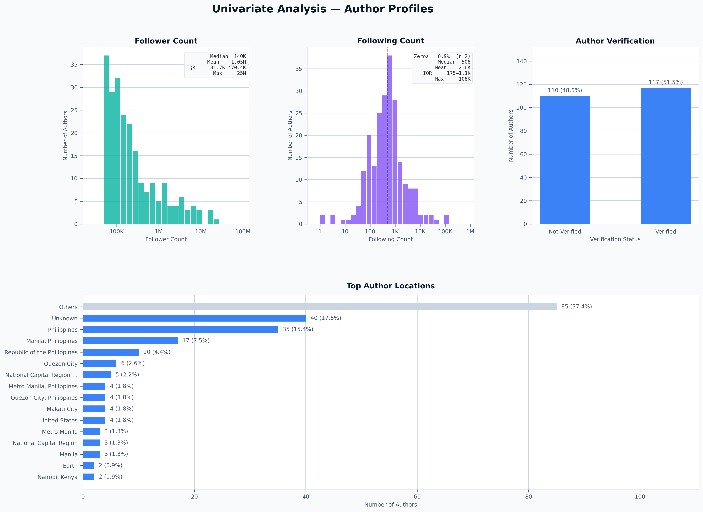
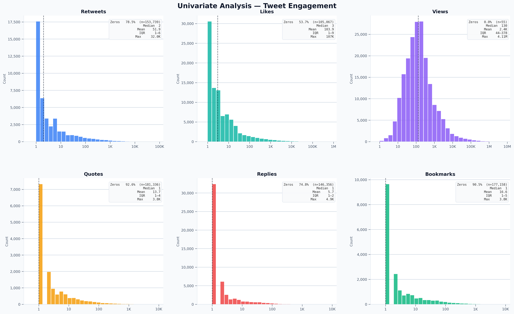
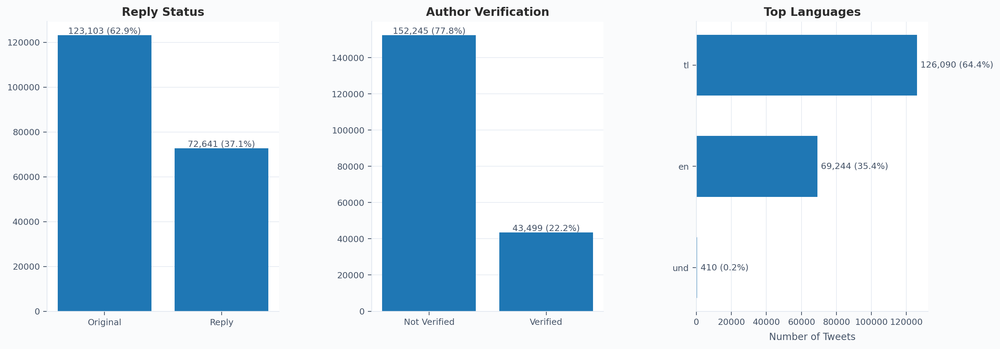
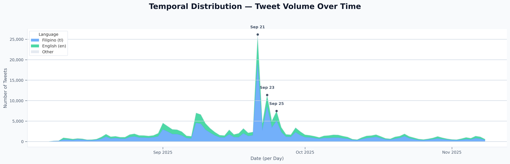
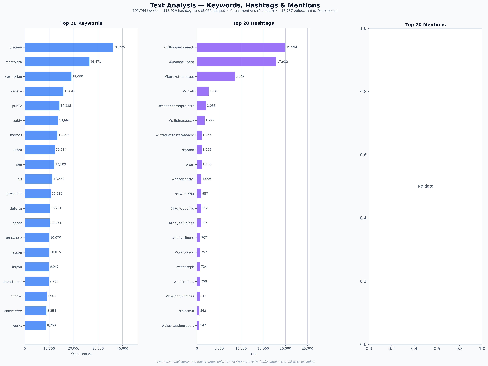

# 🌊 PH Flood Control Pulse
### An Exploratory Data Analysis of Public Tweets on DPWH Flood Control Projects

> *When typhoon season hits the Philippines, one of the loudest conversations on social media isn't about the weather — it's about the government.*

This project explores nearly **200,000 public tweets** from influential Twitter/X accounts discussing the **DPWH (Department of Public Works and Highways)** and its flood control projects. Before diving into patterns and trends, this EDA answers the most important question first: **can we trust this data?** Every chart, every number, and every conclusion is only as reliable as the data behind it — so we start there.

> 📦 **Data Source:** [DPWH Flood Control Projects 2025 — Kaggle](https://www.kaggle.com/datasets/bwandowando/tweets-on-dpwh-and-flood-control-projects-2025)

---

## 📋 Table of Contents

- [What's in the Data?](#whats-in-the-data)
- [Dataset 1: Authors](#dataset-1-authors)
  - [Shape](#shape)
  - [Schema](#schema)
  - [Missing Data](#missing-data)
  - [Data Quality](#data-quality)
  - [Univariate Analysis](#univariate-analysis--author-profiles)
- [Dataset 2: Tweets](#dataset-2-tweets)
  - [Shape](#shape-1)
  - [Schema](#schema-1)
  - [Missing Data](#missing-data-1)
  - [Data Quality](#data-quality-1)
  - [Engagement Distribution](#univariate-analysis--tweet-engagement)
  - [Categoricals](#univariate-analysis--tweet-categoricals)
  - [Temporal Distribution](#temporal-distribution)
- [Preprocessing Summary](#preprocessing-summary)
- [Text Analysis](#text-analysis--keywords-hashtags--top-phrases)

---

## What's in the Data?

Two datasets work together to tell the full story — one about the **people** behind the tweets, one about the **tweets** themselves.

| # | Dataset | Rows | Columns | What it contains |
|---|---|---|---|---|
| 1 | `well_known_authors_dpwh_floodcontrol` | 227 | 8 | Author profiles — follower counts, location, verification status |
| 2 | `for_export_dpwh_floodcontrol` | 195,744 | 16 | Tweets — text, engagement metrics, timestamps, language |

Each dataset goes through four inspection steps before any analysis begins:

> **Shape** → how big is it? &nbsp;·&nbsp; **Schema** → what types are the columns? &nbsp;·&nbsp; **Missing Data** → what's absent and why? &nbsp;·&nbsp; **Data Quality** → what needs fixing?

---

## Dataset 1: Authors

### Shape


**227 authors generated nearly 200,000 tweets.** This is a small, curated group of influential voices — not a random sample of everyday Twitter users. Think news outlets, government agencies, and public figures, not anonymous accounts.

---

### Schema


The schema is simple: **5 text columns, 2 numeric, 1 boolean** — covering identity, reach, and verification status. Two columns have type issues that need fixing before analysis, addressed in the Data Quality section below.

---

### Missing Data


**2 of 8 columns have missing values — and both are missing by choice, not error.** This is an important distinction. A blank field that exists because someone chose not to fill it in is fundamentally different from one that's blank because something went wrong in data collection.

> **Quick reference — the three types of missingness:**
> - **MCAR (Missing Completely At Random)** — the blank has no relationship to any data, observed or unobserved. A server glitch drops random rows. Pure chance, no bias introduced.
> - **MAR (Missing At Random)** — the blank is explainable by *other observed columns*, not by the missing value itself. Safe to handle with imputation or flagging.
> - **MNAR (Missing Not At Random)** — the blank is caused by the missing value itself. Someone skips the income field *because* their income is high. The most consequential type — the absence carries information.

#### `author_location` — 40 missing (17.6%)

**Type: MNAR — Missing Not At Random**

The reason this field is blank is directly tied to what the value would have been — authors who prefer not to disclose their location simply don't fill it in. The decision to leave it blank is driven by the location itself (privacy preference, sensitivity, desire for anonymity). No other column in the dataset tells us *why* these specific authors opted out. That's the defining characteristic of MNAR: the missingness is caused by the missing value itself, not by chance or by another observable variable.

> ⚠️ **Implication:** We cannot safely impute these values — any guess would be fabricated. The 40 missing authors may not be geographically representative of those who did share their location, so location-based analyses should be interpreted with that caveat in mind.

> ✅ **Decision: Keep and fill with `"Unknown"`.** Preserves all rows for non-location analyses without introducing false geographic data.

#### `author_profile_bio_description` — 6 missing (2.6%)

**Type: MNAR — Missing Not At Random**

Same mechanism as location — authors who chose not to write a bio made that choice based on the content they would have written (or their preference not to share it). The absence reflects a deliberate decision about the value itself. At only 6 rows (2.6%), the practical impact on analysis is negligible, but the classification is still MNAR.

> ✅ **Decision: Keep and fill with `"No bio provided"`.** Only 6 rows affected. No meaningful impact on analysis.

**All other 6 columns are 100% complete.** Nothing needs to be removed.

---

### Data Quality


**0 critical issues. 3 warnings** — all minor and straightforward to fix.

#### 🟡 Wrong Data Types — 2 columns

Some columns are stored in a format that looks fine on screen but breaks calculations. A date stored as plain text, for example, can be read but can't be sorted or used to calculate time differences.

| Column | Stored as | Should be | Why it matters |
|---|---|---|---|
| `author_createdAt` | `str` (text) | `datetime64` (date) | Can't calculate account age without converting this first |
| `author_isBlueVerified` | mixed `bool`/`str` | `bool` (true/false) | Inconsistent format — filters and comparisons will silently fail |

```python
authors["author_createdAt"] = pd.to_datetime(authors["author_createdAt"], utc=True)
authors["author_isBlueVerified"] = authors["author_isBlueVerified"].astype(bool)
```

#### 🟡 Inconsistent Values — 1 column

**`author_location`** — 16 entries (7%) are technically filled but not usable as locations. These include things like `"Earth"`, `"WhatsApp & Telegram"`, and social media handles. They look like data, but they're not geographic information.

These get recoded as `"Unknown"` alongside the genuinely blank entries. After cleaning, **170 of 227 authors (74.9%)** have a real, usable location.

---

### Univariate Analysis — Author Profiles



Four things stand out from the distributions.

**These are not ordinary users.** The median follower count is 140,000 — meaning half the accounts in this dataset have more than 140K followers. The mean jumps to 1.1M because a small number of mega-accounts (up to 25M followers) pull the average up dramatically. This is the behavior of media outlets and institutional accounts, not personal profiles.

**They follow people deliberately.** A median following count of 508, with most accounts between 175 and 1,100 accounts followed, suggests these authors curate their feeds. They're not follow-everyone accounts.

**More than half are officially verified.** 51.5% hold Blue Verified status — an unusually high rate compared to the general Twitter population. This reinforces the institutional nature of the dataset: these are credentialed accounts that Twitter itself has reviewed.

**The conversation is geographically concentrated.** Manila and its surrounding regions dominate the location data, which makes sense for a dataset centered on a national infrastructure agency headquartered in Metro Manila. The 43.2% "Others" category is a reminder that self-reported location fields are messy — the same place gets written dozens of different ways.

---

## Dataset 2: Tweets

### Shape


**195,744 tweets across 16 columns.** Large enough to surface real patterns in how people engage with flood control topics over time — and rich enough, with 9 numeric engagement columns, to go well beyond just counting tweets.

---

### Schema


**9 of 16 columns are engagement metrics** (retweets, likes, views, quotes, replies, bookmarks, and more) stored as integers — making this a quantitatively dense dataset. Four columns have type issues flagged for fixing in the Data Quality section.

---

### Missing Data


**Only 2 of 16 columns have missing values — and both are supposed to be empty for most rows.** Not every blank field is a problem. Sometimes absence is the data.

> **Quick reference — the three types of missingness:**
> - **MCAR (Missing Completely At Random)** — the blank has no relationship to any data, observed or unobserved. Pure chance, no bias introduced.
> - **MAR (Missing At Random)** — the blank is fully explained by *other observed columns*, not by the missing value itself. Safe to handle with imputation or flagging.
> - **MNAR (Missing Not At Random)** — the blank is caused by the missing value itself. The most consequential type — the absence carries information.
> - **Structurally Missing** — a recognized subtype of MNAR where the value is absent *by definition*, not by randomness or user choice. The field simply cannot exist for certain rows due to the nature of the data.

#### `quoted_pseudo_id` — 170,346 missing (87%)

**Type: Structurally Missing (MNAR subtype)**

This field stores the ID of the tweet being quoted — it can only exist if the tweet *is* a quote tweet. For the 87% of tweets that are original posts, the field is absent not because of randomness, not because another column predicts it, but because **a non-quote tweet structurally cannot have a quoted tweet ID**. No observed variable causes this absence; the tweet's own nature does. This is the defining characteristic of structurally missing data: the value is undefined by definition, not missing due to chance or user behaviour.

> ✅ **Decision: Keep as-is.** Filling it would introduce false information. Removing these rows would delete 87% of the dataset.

#### `pseudo_inReplyToUsername` — 123,213 missing (62.9%)

**Type: MAR — Missing At Random**

Unlike `quoted_pseudo_id`, this field's missingness *is* fully explained by an observed column — `isReply`. When `isReply = False`, this field is always blank. When `isReply = True`, it is always filled. The two columns move in perfect lockstep with zero exceptions. Because another observable variable completely accounts for the absence, this is genuinely MAR — not structural, not random, but predictable from existing data.

> ✅ **Decision: Keep as-is.** No guessing needed. Removing these rows would delete every original tweet.

**All remaining 14 columns are 100% complete.** The dataset is structurally clean.

---

### Data Quality


**1 critical issue. 6 warnings** — none are blockers. All are standard, well-understood fixes.

#### 🔴 Duplicate Rows — 1 row

One tweet appears twice, most likely a scraping overlap at a collection boundary. The impact is negligible, but duplicates should always be removed before counting or aggregating.

```python
df = df.drop_duplicates(subset=["pseudo_id"])
```

#### 🟡 Wrong Data Types — 4 columns

| Column | Stored as | Should be | Why it matters |
|---|---|---|---|
| `createdAt` | `str` (text) | `datetime64` (date) | Can't sort by time or plot trends without this |
| `isReply` | mixed `bool`/`str` | `bool` (true/false) | Inconsistent format causes silent comparison failures |
| `pseudo_inReplyToUsername` | `float64` (decimal) | `str` (text) | IDs got converted to decimals because of blank rows — loses precision |
| `author_isBlueVerified` | mixed `bool`/`str` | `bool` (true/false) | Same issue as `isReply` |

```python
df["createdAt"] = pd.to_datetime(df["createdAt"], utc=True)
df["isReply"] = df["isReply"].astype(bool)
df["author_isBlueVerified"] = df["author_isBlueVerified"].astype(bool)
df["pseudo_inReplyToUsername"] = df["pseudo_inReplyToUsername"].astype("Int64").astype(str)
```

#### 🟡 Inconsistent Values — 2 columns

**`lang`** — 410 rows (0.2%) carry the code `und` (undetermined — the language detector couldn't classify the tweet). These are treated as a separate category rather than forced into Filipino or English.

| Language | Count | Share |
|---|---|---|
| Filipino (`tl`) | 126,090 | 64.4% |
| English (`en`) | 69,244 | 35.4% |
| Undetermined (`und`) | 410 | 0.2% |

**`pseudo_inReplyToUsername`** — stored as decimal numbers due to blank rows being misread. Resolved automatically by the type fix above.

---

### Univariate Analysis — Tweet Engagement



The six engagement distributions tell a single, consistent story: **most people read and do nothing.**

Zero-inflation is high across every metric — 78.5% of tweets got zero retweets, 92.6% got zero quotes, 90.5% got zero bookmarks. Views are the exception (near-zero blank rate) because the platform records a view the moment someone scrolls past a tweet. Seeing is automatic. Engaging is a choice — and most people don't.

For the tweets that did receive engagement, the distributions are heavily skewed to the right. The gap between the median and the mean is the key signal: Retweets (median 2, mean 51), Likes (median 3, mean 103). A handful of viral tweets are pulling the averages far above what a typical post receives.

This is exactly what you'd expect from institutional accounts covering a government infrastructure topic: steady, low-engagement activity punctuated by spikes when a typhoon hits, a flood goes viral, or a political controversy erupts.

---

### Univariate Analysis — Tweet Categoricals



**62.9% of tweets are original posts, not replies.** This is a broadcasting dataset — accounts publishing statements, not having conversations. Authors are speaking *about* DPWH flood control, not necessarily speaking *to* each other.

**Filipino (Tagalog) accounts for 64.4% of tweets, English 35.4%.** The bilingual split reflects how Philippine public discourse works: local issues get discussed in Filipino first, with English commentary layered on top. On a topic as local as national flood infrastructure, Filipino dominates.

**22.2% of tweets come from verified accounts** — lower than the 51.5% verification rate in the authors dataset. This means the verified accounts, despite being the most prominent voices, are actually responsible for a smaller share of the total volume. The unverified majority are doing more of the posting.

---

### Temporal Distribution



The timeline has one story that drowns out everything else: **September 21 was an event.**

A single day produced roughly 25,000 tweets — approximately 10 times the daily baseline. The follow-on spikes on September 23 and September 25 show the conversation didn't collapse immediately; it had momentum. Outside this September cluster, volume returns to a low, steady hum through October and November 2025.

The Filipino-language layer drives the spike almost entirely. English engagement rises alongside it but at a noticeably lower amplitude — consistent with Filipino-language media breaking the story first, with English-language accounts picking it up afterward. The pattern suggests a single real-world event triggered the surge, not an organic gradual build.

---

## Preprocessing Summary

All fixes applied before any further analysis proceeds. Both datasets are clean and ready.

### Dataset 1 — Authors

```python
# Fix data types
authors["author_createdAt"] = pd.to_datetime(authors["author_createdAt"], utc=True)
authors["author_isBlueVerified"] = authors["author_isBlueVerified"].astype(bool)

# Standardise locations — replace non-geographic entries and blanks
invalid_locations = [
    "Earth", "Around The World", "facebook.com/aidelacruzonline",
    "Abbott Elementary", "WhatsApp & Telegram"
]
authors["author_location"] = authors["author_location"].replace(invalid_locations, "Unknown")
authors["author_location"] = authors["author_location"].fillna("Unknown")

# Fill missing bios
authors["author_profile_bio_description"] = (
    authors["author_profile_bio_description"].fillna("No bio provided")
)
```

### Dataset 2 — Tweets

```python
# Remove duplicate tweet
df = df.drop_duplicates(subset=["pseudo_id"])

# Fix data types
df["createdAt"] = pd.to_datetime(df["createdAt"], utc=True)
df["isReply"] = df["isReply"].astype(bool)
df["author_isBlueVerified"] = df["author_isBlueVerified"].astype(bool)
df["pseudo_inReplyToUsername"] = df["pseudo_inReplyToUsername"].astype("Int64").astype(str)

# Recode undetermined language
df["lang"] = df["lang"].replace("und", "other")
```

---

*Analysis conducted using Python · pandas · matplotlib. All visualisations generated programmatically for full reproducibility.*

---

## Text Analysis — Keywords, Hashtags & Top Phrases

> *Numbers tell you how much people engaged. Text tells you what they were actually saying.*

With engagement distributions and temporal patterns established, the next question is: **what language did people use?** This section extracts the most frequent single words, organised hashtag campaigns, and two-word phrases from all 195,744 tweets — revealing the key actors, themes, and narratives driving the conversation.

> ⚙️ **Method note:** Before counting, all tweets were stripped of URLs, @mentions, stopwords (English and Filipino), and domain-specific noise words (`flood`, `control`, `dpwh`, `project`, etc.) that appear in nearly every tweet and carry no analytical signal. Pseudonymised numeric @mentions (e.g. `@972890161400492`) were excluded entirely — 117,737 of them — since they represent anonymised account IDs with no linguistic meaning. Two-word phrases (bigrams) are the most frequent word pairs after the same cleaning pipeline.

---

### Text Analysis Overview



---

### Keywords

**Two names dominate the discourse above all else: Discaya (36,225) and Marcoleta (26,471).**

These are not institutions — they are individuals. The fact that two personal surnames sit so far above everything else, including the word "corruption" in third place (19,088), tells us this conversation is not abstract. It is directed. People are talking *about specific people*, not just about systemic problems.

The top 15 keywords cluster into three clear groups:

**Named individuals** — Discaya, Marcoleta, Zaldy, Marcos, Duterte, Romualdez, Lacson, Sotto, Ferdinand. These are the people the public is holding accountable, debating, or defending in connection with the flood control controversy.

**The core accusation** — "corruption" (#3, 19,088) and "ghost" (#10, 8,468) together form the central narrative: that flood control funds were stolen through ghost projects — infrastructure spending that existed only on paper.

**Organisational reference** — "pbbm" (#6, 12,284) and "contractors" (#13, 7,109) place the conversation in its institutional context — the current administration and the private firms implicated in the contracts.

The sharp drop-off after the top three is telling. Discaya alone appears nearly **twice as often** as the fourth-ranked term (Zaldy, 13,664) — suggesting one figure attracted a disproportionate share of public attention, likely as the central name surfaced in Senate investigations.

---

### Hashtags

**`#trillionpesomarch` (19,994) and `#bahasaluneta` (17,932) are not just hashtags — they are mobilisation calls.**

Together they account for nearly 38,000 hashtag uses and represent organised citizen action: a call to march and a reference to a specific protest gathering point (Luneta Park). The fact that these two campaign hashtags outpace even `#dpwh` (2,640) by a factor of 7 indicates this dataset captures not just commentary but active civic organising.

`#kurakotmanagot` (#3, 8,547) — roughly translating to "corrupt people must be held accountable" — reinforces the accountability framing. The three dominant hashtags together paint a picture of a public that moved from outrage to organised demand.

**8,655 unique hashtags** across 113,929 total uses means the conversation, while concentrated at the top, was also fragmented — thousands of people bringing their own framing to the same event.

---

### Phrases (Bigrams)

**The bigrams resolve individual keywords into identities.** Where "ferdinand" and "marcos" appear separately in the keywords list, "ferdinand marcos" (4,226) as a bigram confirms they are almost always used together — referring to the president by full name.

The top 10 bigrams are almost exclusively proper names:

| Rank | Bigram | Co-occurrences |
|---|---|---|
| #1 | ferdinand marcos | 4,226 |
| #2 | curlee discaya | 3,535 |
| #3 | chiz escudero | 2,855 |
| #4 | brice hernandez | 2,678 |
| #5 | jinggoy estrada | 2,647 |
| #6 | henry alcantara | 2,395 |
| #7 | rodante marcoleta | 2,283 |
| #8 | joel villanueva | 2,011 |
| #9 | tito sotto | 1,560 |
| #10 | mark villar | 1,526 |

This is a named-actor conversation. The public discourse around DPWH flood control is almost entirely organised around specific political figures — senators, former officials, and contractors — rather than around policy abstractions or systemic reform language. Every name in the top 10 bigrams is a person, not a concept.

The presence of Senate figures (Escudero, Estrada, Villanueva, Sotto) alongside the primary accused (Discaya, Marcoleta) suggests the conversation was tracking the Senate investigation closely — people were naming both the subjects of scrutiny and the officials conducting it.

---

> 💡 **Takeaway:** The text analysis tells a story the engagement metrics could not: this dataset is not about flood control infrastructure — it is about **accountability**. The language is personal, named, and politically charged. Citizens were not discussing drainage systems; they were naming the people they believed responsible for the failures.