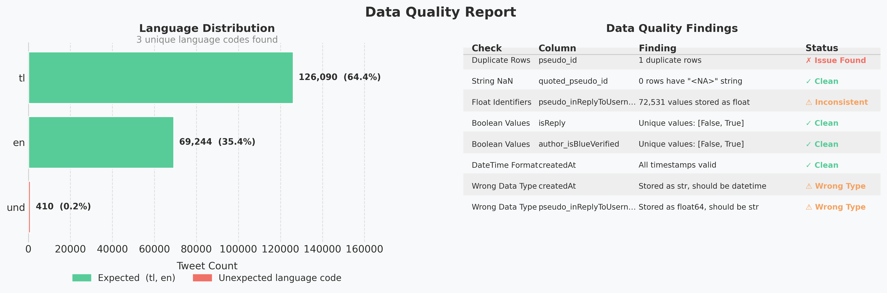
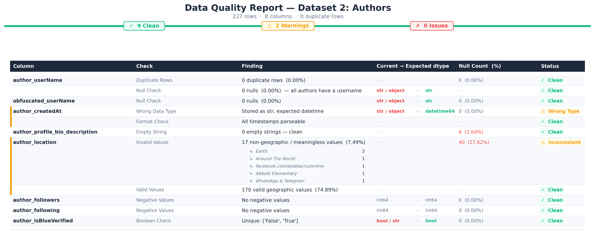

# PH Flood Control Pulse: An Exploratory Data Analysis of Public Tweets

When Typhoon season hits the Philippines, one of the loudest conversations on Twitter isn't about the weather — it's about the government. This EDA explores public tweets from well-known Twitter accounts discussing the DPWH (Department of Public Works and Highways) and its flood control projects, starting with the most important question before any analysis: **can we trust this data?**

> 📦 **Source:** [DPWH Flood Control Projects 2025 — Kaggle](https://www.kaggle.com/datasets/bwandowando/tweets-on-dpwh-and-flood-control-projects-2025)

| | Dataset | Rows | Columns | Contains |
|---|---|---|---|---|
| 1 | `for_export_dpwh_floodcontrol` | 195,744 | 16 | Tweets — text, engagement metrics, timestamps, language |
| 2 | `well_known_authors_dpwh_floodcontrol` | 227 | 8 | Authors — profiles, follower counts, verification status |

Each dataset is examined across four steps: **shape → schema → missing data → data quality.**

---

## Dataset 1: Tweets

### 1.1 Dataset Shape


**195,744 tweets across 16 columns.** Large enough to find meaningful patterns in engagement, language, and time — each row carries the full context of a tweet beyond just its text.

---

### 1.2 Column Names & Data Types


**9 of 16 columns are engagement metrics** (`int64`), making this a quantitatively rich dataset. Four columns have type issues that need fixing before analysis — addressed in Section 1.4.

---

### 1.3 Missing Data Analysis


**Only 2 of 16 columns have missing values — and both are missing by design, not by accident.** Not all nulls are problems. Here, the absence of a value is itself meaningful information.

#### `quoted_pseudo_id` — 170,346 missing (87%) · `Structurally Missing`

A quoted tweet ID can only exist if the tweet is quoting another. **87% of tweets are original posts** — so this field is empty for the vast majority of rows, and that's exactly correct.

> **Decision: Keep as-is.** Filling it would be wrong. Removing these rows would delete 87% of the dataset.

#### `pseudo_inReplyToUsername` — 123,213 missing (62.9%) · `Missing At Random (MAR)`

This field is always empty when `isReply = False` and always filled when `isReply = True` — the two columns move in perfect sync. Because missingness is fully explained by an observable column, this is **MAR**.

> **Decision: Keep as-is.** No imputation needed. Removal would eliminate every original (non-reply) tweet.

**The remaining 14 columns are fully complete.** No rows need to be removed.

---

### 1.4 Data Quality Report



**1 issue, 6 warnings** — none are showstoppers. All are standard preprocessing fixes.

#### 🔴 Duplicate Rows — 1 row

One tweet appears twice in the dataset, almost certainly a scraping overlap. Negligible impact but should be dropped before aggregation.

```python
df = df.drop_duplicates(subset=["pseudo_id"])
```

#### 🟡 Wrong Data Types — 4 columns

Four columns are stored in the wrong format. Think of it like storing a date as plain text — readable, but useless for calculations until fixed.

| Column | Stored as | Should be | Why it matters |
|---|---|---|---|
| `createdAt` | `str` | `datetime64` | Can't sort by time or plot trends without this fix |
| `isReply` | `bool / str` | `bool` | Mixed serialisation — comparisons will silently fail |
| `pseudo_inReplyToUsername` | `float64` | `str` | IDs coerced to decimals due to NaN presence — loses precision |
| `author_isBlueVerified` | `bool / str` | `bool` | Same mixed serialisation issue as `isReply` |

```python
df["createdAt"] = pd.to_datetime(df["createdAt"], utc=True)
df["isReply"] = df["isReply"].astype(bool)
df["author_isBlueVerified"] = df["author_isBlueVerified"].astype(bool)
df["pseudo_inReplyToUsername"] = df["pseudo_inReplyToUsername"].astype("Int64").astype(str)
```

#### 🟡 Inconsistent Values — 2 columns

**`lang`** — 410 rows (0.21%) carry the code `'und'` (undetermined), outside the expected `{'tl', 'en'}`. Exclude or recode as `'other'` in language analysis.

| Language | Count | % |
|---|---|---|
| `tl` Filipino | 126,090 | 64.4% |
| `en` English | 69,244 | 35.4% |
| `und` Undetermined | 410 | 0.2% |

**`pseudo_inReplyToUsername`** — 72,531 non-null values stored as `float64`. This resolves automatically once the column is cast to `str` (see fix above).

---

## Dataset 2: Authors

### 2.1 Dataset Shape


**227 authors drove nearly 200,000 tweets.** This is a small, curated group of influential voices — not a random cross-section of Twitter.

---

### 2.2 Column Names & Data Types


**5 `str` · 2 `int64` · 1 `bool`** — a simple schema covering identity, reach, and context. Two columns have type issues (`author_createdAt`, `author_isBlueVerified`) addressed in Section 2.4.

---

### 2.3 Missing Data Analysis


**2 of 8 columns have missing values — both are Missing Not At Random (MNAR).** Unlike the tweets dataset, these fields *could* be filled — the authors simply chose not to. When missingness is driven by the person's own decision rather than anything we can measure, it's MNAR.

#### `author_location` — 40 missing (17.6%) · `MNAR`

Twitter's location field is optional. 40 authors left it blank by choice.

> **Decision: Retain; fill with `"Unknown"`.** We can't guess someone's location — filling with a placeholder preserves the row for other analysis.

#### `author_profile_bio_description` — 6 missing (2.6%) · `MNAR`

6 authors chose not to write a bio.

> **Decision: Retain; fill with `"No bio provided"`.** Only 6 rows. Bio is non-critical; a placeholder is appropriate.

**The remaining 6 columns are fully complete.** No rows need to be removed.

---

### 2.4 Data Quality Report



**0 issues, 3 warnings.** The author dataset is structurally sound — just two type fixes and one value cleanup needed.

#### 🟡 Wrong Data Types — 2 columns

| Column | Stored as | Should be | Why it matters |
|---|---|---|---|
| `author_createdAt` | `str` | `datetime64` | Can't compute account age without this fix |
| `author_isBlueVerified` | `bool / str` | `bool` | Mixed serialisation — normalise before filtering |

```python
authors["author_createdAt"] = pd.to_datetime(authors["author_createdAt"], utc=True)
authors["author_isBlueVerified"] = authors["author_isBlueVerified"].astype(bool)
```

#### 🟡 Inconsistent Values — 1 column

**`author_location`** — 16 entries (7.05%) are non-geographic: platform handles, URLs, and colloquialisms like `"Earth"` and `"WhatsApp & Telegram"`. These should be recoded as `"Unknown"` alongside the actual missing values. After cleaning, **170 authors (74.9%)** have a usable location.

---

## Preprocessing Summary

Before any further analysis, apply these fixes to both datasets:

### Tweets

```python
# Drop duplicate
df = df.drop_duplicates(subset=["pseudo_id"])

# Fix types
df["createdAt"] = pd.to_datetime(df["createdAt"], utc=True)
df["isReply"] = df["isReply"].astype(bool)
df["author_isBlueVerified"] = df["author_isBlueVerified"].astype(bool)
df["pseudo_inReplyToUsername"] = df["pseudo_inReplyToUsername"].astype("Int64").astype(str)

# Recode undetermined language
df["lang"] = df["lang"].replace("und", "other")
```

### Authors

```python
# Fix types
authors["author_createdAt"] = pd.to_datetime(authors["author_createdAt"], utc=True)
authors["author_isBlueVerified"] = authors["author_isBlueVerified"].astype(bool)

# Standardise locations
invalid_locations = ["Earth", "Around The World", "facebook.com/aidelacruzonline",
                     "Abbott Elementary", "WhatsApp & Telegram"]
authors["author_location"] = authors["author_location"].replace(invalid_locations, "Unknown")
authors["author_location"] = authors["author_location"].fillna("Unknown")

# Fill missing bios
authors["author_profile_bio_description"] = (
    authors["author_profile_bio_description"].fillna("No bio provided")
)
```

Both datasets are now clean and ready for analysis.