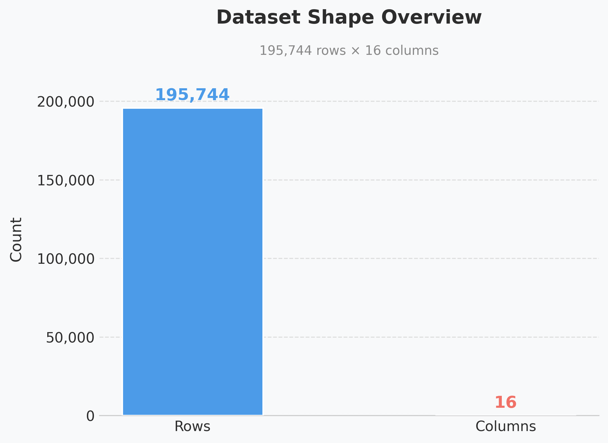
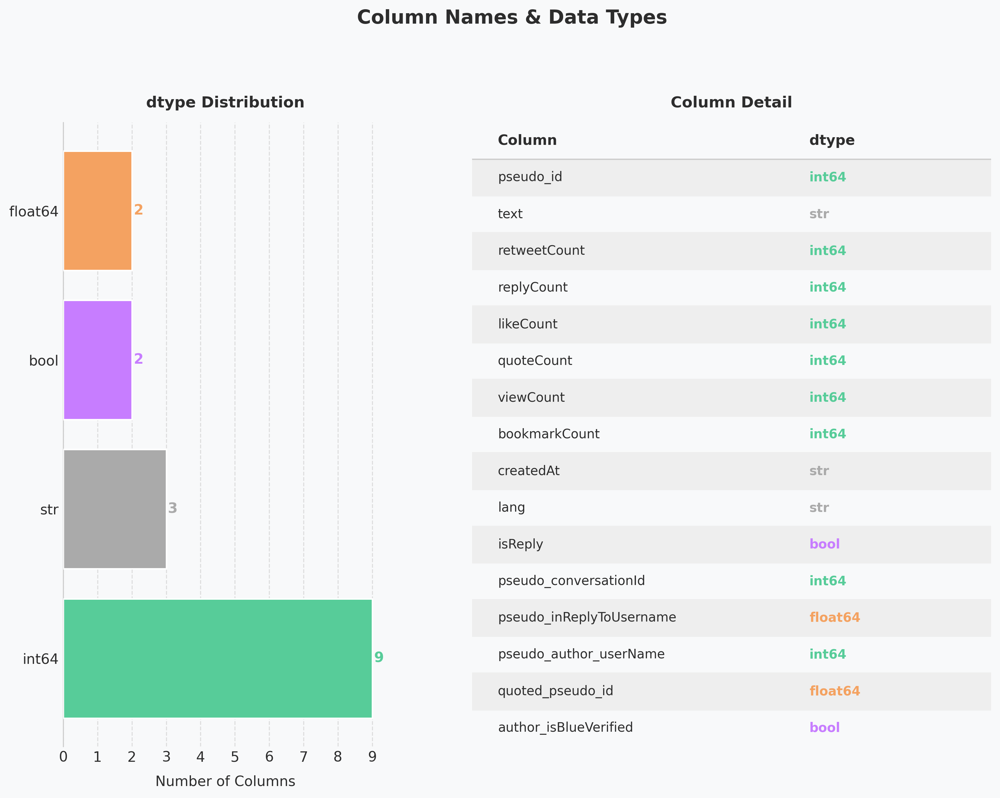
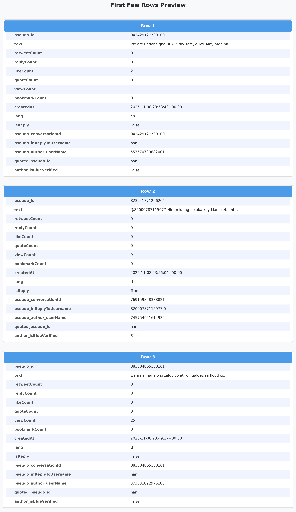
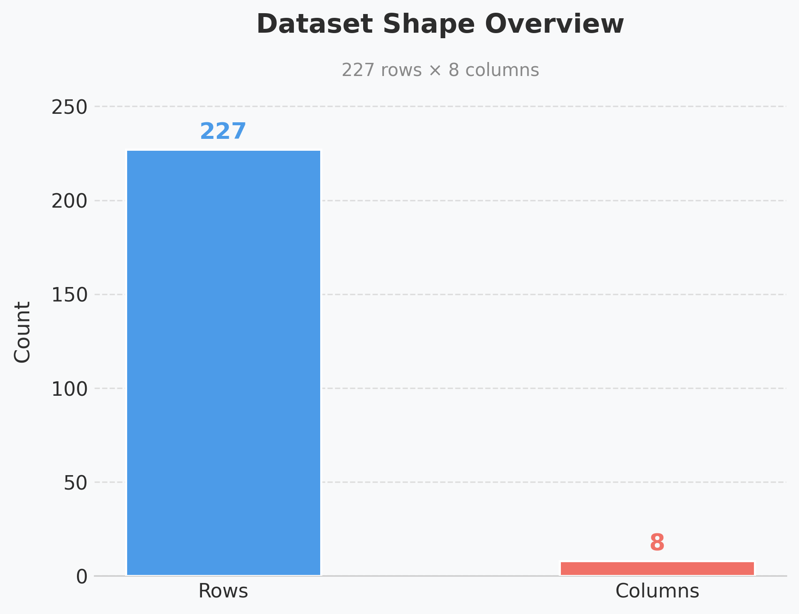
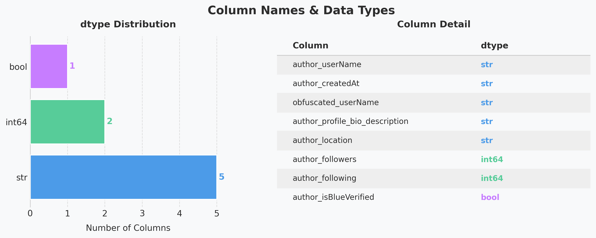
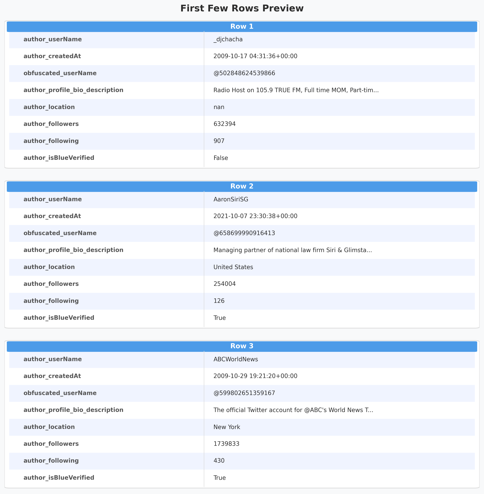

# PH Flood Control Pulse: An EDA of Public Tweets

This project provides Exploratory Data Analysis for [public tweets of well-known Twitter authors regarding about the PH Flood Control issue of the DPWH](https://www.kaggle.com/datasets/bwandowando/tweets-on-dpwh-and-flood-control-projects-2025) (Department of Public Works and Highways).

---

## Dataset 1: For Export (DPWH Flood Control Tweets)

### 1.1 Dataset Shape

> The dataset contains **195,744 rows** and **16 columns**, indicating a large
> volume of tweet data collected for analysis.

### 1.2 Column Names & Data Types

> The dataset consists mostly of `int64` columns (9), followed by `str` (3),
> `float64` (2), and `bool` (2). Engagement metrics such as `retweetCount`,
> `likeCount`, and `viewCount` are all numeric, while `text` and `lang` are string columns.

### 1.3 First Few Rows

> A preview of the first 3 rows shows tweets in both English (`en`) and Tagalog (`tl`),
> with most having low engagement counts. The `text` column contains the raw tweet content.

---

## Dataset 2: Well Known Authors (DPWH Flood Control)

### 2.1 Dataset Shape

> This dataset contains **227 rows** and **8 columns**, representing a curated
> list of well-known Twitter authors who tweeted about the DPWH flood control issue.

### 2.2 Column Names & Data Types

> The dataset is predominantly `str` columns (5), with `int64` (2) for follower/following
> counts and `bool` (1) for blue verification status.

### 2.3 First Few Rows

> The first 3 rows reveal high-profile accounts with large follower counts (632K, 254K, 1.7M).
> Notable accounts include a radio host, a lawyer, and ABCWorldNews — suggesting
> the dataset captures both local and international voices.
---

## Note

- When should I remove the row?
    70-90% of values of every variable is NULL for that row
    If the value of the primary key or identifier is missing
    The target variable is missing (in Machine Learning case)

- When should I keep the row?
    Few values of different variable is NULL for that row
    Missingness is valid (for example the end_date column for storing the end date of OJT)
