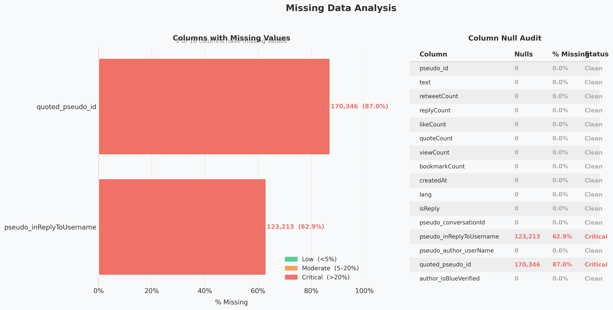
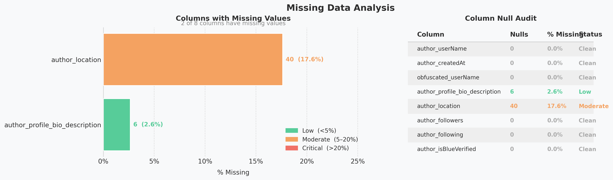

# PH Flood Control Pulse: An EDA of Public Tweets

This project provides Exploratory Data Analysis for [public tweets of well-known Twitter authors regarding about the PH Flood Control issue of the DPWH](https://www.kaggle.com/datasets/bwandowando/tweets-on-dpwh-and-flood-control-projects-2025) (Department of Public Works and Highways).

---

## Dataset 1: For Export (DPWH Flood Control Tweets)

### 1.1 Dataset Shape

> The dataset contains **195,744 rows** and **16 columns**, indicating a large
> volume of tweet data collected for analysis.

### 1.2 Column Names & Data Types

> The dataset consists mostly of `int64` columns (9), followed by `str` (3),
> `float64` (2), and `bool` (2). Engagement metrics such as `retweetCount`,
> `likeCount`, and `viewCount` are all numeric, while `text` and `lang` are string columns.

### 1.3 Missing Data Analysis

> **2 of 16 columns** have missing values.
>
> | Column | Missing | % | Type | Reason | Decision |
> |---|---|---|---|---|---|
> | `quoted_pseudo_id` | 170,346 | 87.0% | **Structurally Missing** | The value is logically impossible to exist for non-quote tweets — there is no quoted tweet ID to store. No imputation can produce a meaningful value | **Keep as-is** — no imputation needed. The absence of a value is itself meaningful: it tells us the tweet is not a quote tweet. Removing these rows would eliminate 87% of the dataset |
> | `pseudo_inReplyToUsername` | 123,213 | 62.9% | **MAR** | Missingness is perfectly predicted by `isReply` — when `isReply = False`, this column is always empty; when `isReply = True`, it is always filled | **Keep as-is** — no imputation needed. The missing value is already explained by `isReply`. Removing these rows would eliminate 62.9% of the dataset including all original tweets |
>
> No rows need to be removed. The remaining **14 columns are clean** with 0% missing values.

---

## Dataset 2: Well Known Authors (DPWH Flood Control)

### 2.1 Dataset Shape

> This dataset contains **227 rows** and **8 columns**, representing a curated
> list of well-known Twitter authors who tweeted about the DPWH flood control issue.

### 2.2 Column Names & Data Types

> The dataset is predominantly `str` columns (5), with `int64` (2) for follower/following
> counts and `bool` (1) for blue verification status.

### 2.3 Missing Data Analysis

> **2 of 8 columns** have missing values. Both are cases of **MNAR** — the values
> are possible to exist but were deliberately not provided by the user.
>
> | Column | Missing | % | Type | Reason | Decision |
> |---|---|---|---|---|---|
> | `author_location` | 40 | 17.6% | **MNAR** | The user deliberately chose not to share their location — the value is possible to exist but was intentionally omitted. Since missingness depends on the user's own privacy choice (the missing value itself), this is MNAR | **Keep, fill with `"Unknown"`** — 40 rows (17.6%) are affected. Since location is used for geographic analysis, filling with `"Unknown"` preserves the row while clearly marking the absence of data. Mean/mode imputation is not appropriate here since location is a free-text field with no meaningful central value |
> | `author_profile_bio_description` | 6 | 2.6% | **MNAR** | The user deliberately chose not to fill in their bio — the value is possible to exist but was intentionally omitted. Since missingness depends on the user's own choice (the missing value itself), this is MNAR | **Keep, fill with `"No bio provided"`** — only 6 rows (2.6%) are affected. Removing them would lose author records unnecessarily. Imputation with a placeholder is safe since bio is a non-critical descriptive field |
>
> No rows need to be removed. The remaining **6 columns are clean** with 0% missing values.

---